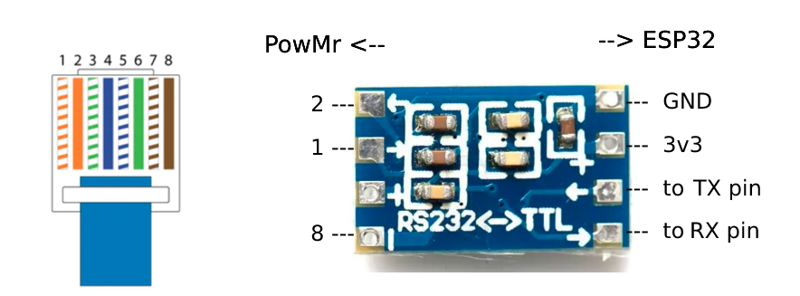

# ESPHome Hybrid Inverter (2341)
This project forked from https://github.com/odya/esphome-powmr-hybrid-inverter 

ESPHome config to monitor and management various PowMr Hybrid Inverter models and Inverters that supported by the [**WIFI-VM (WiFi Plug Pro)**](https://powmr.com/products/powmr-wifi-module-with-rs232-remote-monitoring-solution-wifi-vm) device and `SmartESS` cloud application.

## Protocol
Protocol is Modbus RTU via RS232. Protocol ID (SmartESS) : `2341` (hex 0925). Slave ID : `5`. 

Registers map

1) [registers-map.md from original project](/docs/registers-map.md)
2) [0925.json](/docs/0925.json) in JSON fromat from offical app `SmartESS.apk`
3) [registers-map-SmartESS.md](/docs/registers-map-SmartESS.md) - compilated from `0925.json`

## Connection
  
See PCB board files and example in folder [/pcb/](/pcb/)

## Usage
1) Copy the contents of the `src` repo folder to your ESPHome configuration directory
2) Edit substitutions & customize `powmr-inverter.yaml` & `main.yaml`
3) Flash firmware to your ESP32

The code is divided into packages:
1) `secrets.yaml` - WIFI, OTA, AP passwords
2) `common-system.yaml` - system configuration (wifi, ota, api)
3) `common-sensors.yaml` - common sensor like uptime, wifi signal, total_daily_energy, etc.
4) `inverter.yaml` - basic inverter sensors
5) `inverter-info.yaml` - additional inverter info sensors like Machine Type, nominal input/output voltage, current, power. **Commented out** by default
6) `pzem.yaml` - PZEM module configuration and sensors. **Commented out** by default
7) `pow-hvm4.2m-24v.yaml` - specific configs and sensors for 4.2kW model
8) `pow-hvm6.2m-48v.yaml` - specific configs and sensors for 6.2kW model. **Commented out** by default
9) `pow-hvm10.2m-48v.yaml` - specific configs and sensors for 10.2kW model. **Commented out** by default

Note. Some registers (like Battery Equalization) are commented out in `/modules/inverter.yaml` because I don't need them.

## Inverter card
For easy integration into Home Assistant, you can use the [following snippet](/examples/inverter-card-example.yaml).  
  
[Lovelace dashboard example](/examples/lovelace-powmr.yaml), [screenshot](/examples/inverter-card-screenshots/lovelace_powmr.png).   
The following custom plugins are required: [sunsynk-power-flow-card](https://github.com/slipx06/sunsynk-power-flow-card), [stack-in-card](https://github.com/custom-cards/stack-in-card), [canary](https://github.com/jcwillox/lovelace-canary), [mini-graph-card](https://github.com/kalkih/mini-graph-card).  

## References
- https://github.com/odya/esphome-powmr-hybrid-inverter
- https://github.com/leodesigner/powmr_comm 
- https://github.com/syssi/esphome-smg-ii
- https://github.com/syssi/esphome-pipsolar
- https://github.com/alexeyden/openess
- https://github.com/sabatex/NetDaemonApps.InverterAnenji-4kw-7.2kw
